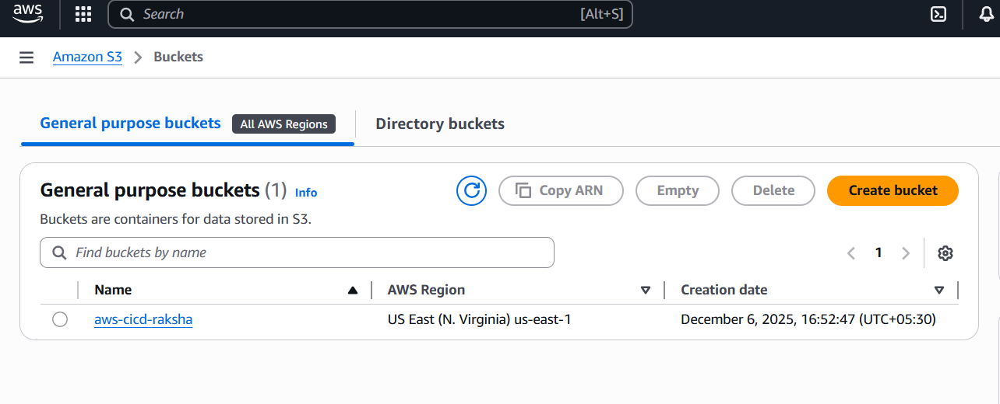
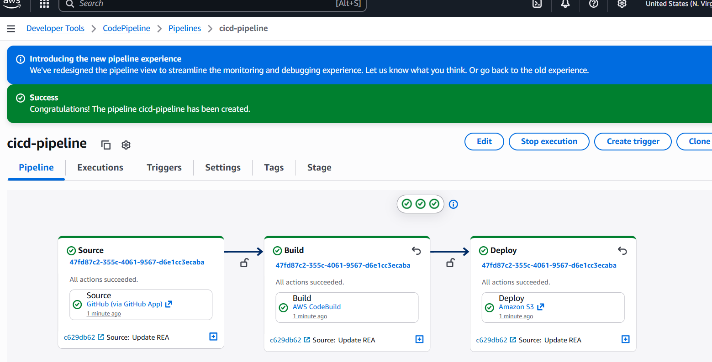
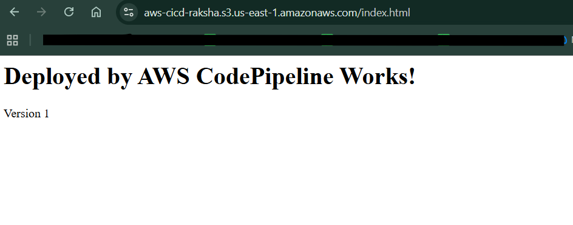
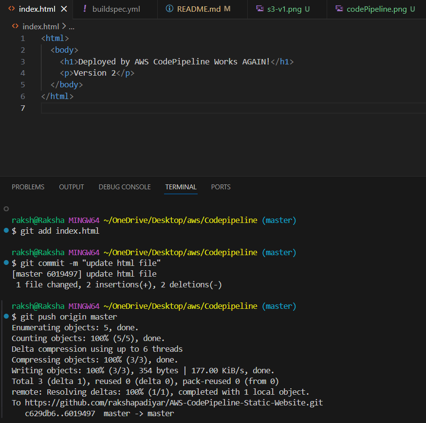
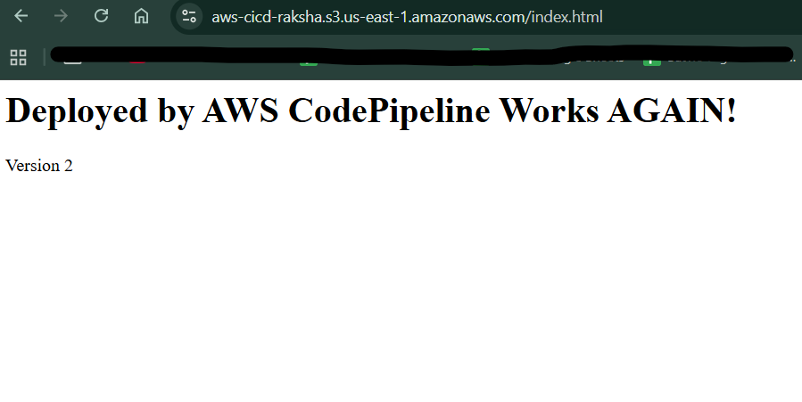

# Static Website CI/CD Using AWS CodePipeline

This project builds a simple CI/CD pipeline that automatically builds and deploys a static website to Amazon S3 using AWS CodePipeline and AWS CodeBuild.

Whenever a commit is pushed to GitHub, the website is automatically rebuilt and updated in the S3 bucket.

---

## Architecture Overview

GitHub → CodePipeline → CodeBuild → S3 Static Website

- CodePipeline detects changes in the GitHub repo
- CodeBuild runs the build steps using `buildspec.yml`
- Build artifacts are deployed to the S3 static website bucket

## Steps
1. Create the S3 Bucket

   * Enable Static Website Hosting
   * Allow public access for testing
   * Enable static website hosting with index.html as index document.
   * Add Permissions :
```
   {
  "Version": "2012-10-17",
  "Statement": [
    {
      "Sid": "PublicReadGetObject",
      "Effect": "Allow",
      "Principal": "*",
      "Action": "s3:GetObject",
      "Resource": "arn:aws:s3:::aws-cicd-raksha/*"
    }
  ]
}

```

---
2. Push Code to GitHub

    Include:  
    HTML files  
    buildspec.yml  
    (js/css files if any)
---
3. Create the CodePipeline
 * Build Custom Pipeline
 * Source provider: GitHub (via GitHub App)
   (Authenticate and establish a connection to teh repository in your GitHub)
* Select your repository and branch

* Build provider: CodeBuild
* Create a new project
* Runtime: Ubuntu latest  
* Choose “Use a buildspec file”
*continue to codepipeline

* Deploy stage: S3

* Target: static site bucket

* Extract artifacts: Yes 
  


---
4. Test the Pipeline

    * Make changes in index.html

    * Commit and push to GitHub  

    

    Pipeline runs automatically

    Refresh S3 website URL to see updated site
    
---
### Summary

You push code to GitHub

CodePipeline detects the new commit

CodeBuild runs the commands from buildspec.yml

Build output is uploaded to S3

The S3 static website reflects the new version instantly
